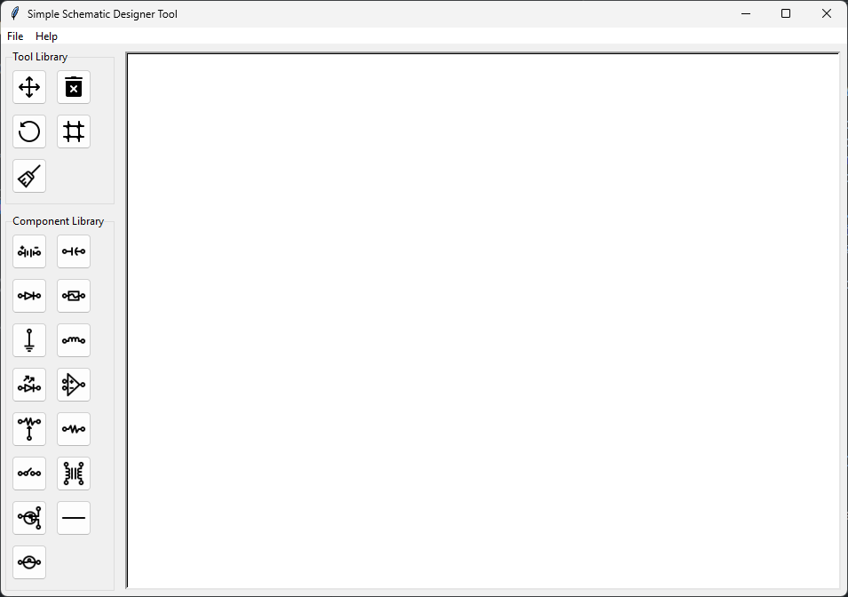

# schemtool-py
A basic Schematic Diagram designer using Tkinter.

## Project Overview

This `schemtool-py` project was created to fulfill academic requirements.

## Project Status

**Note: Markdown is pending.**

Author is currently working on another project.

## Features

- Create electronic schematics.
- Move, rotate, and delete components.
- Toggle grid lines on/off for better alignment.
- Export schematics as PNG files.
- Responsive tool library and component library.
- Component Libraries:
  - Basic Components: Essential components like resistors, capacitors, LEDs, etc.
  - Power Components: Power-related components like batteries, transformers, etc.
  - Advanced Components: Advanced components like op-amps, transistors, etc.
  - Wires: Symbols for connecting components using wires.
- Menu Options:
  - File -> Save: Save the current schematic.
  - File -> Export as PNG: Export the schematic as a PNG file.
  - File -> Change Canvas Size: Adjust the size of the canvas.
  - File -> Exit: Close the application.
- Note: Save function may not work as intended in current version. For better reliability, use 'Export as PNG' frequently.
- Coming Soon:
  - More tools.
  - Bug fixes.
  - More schematic symbols.
  - Optimization improvements.
  - Quality of life improvements.

## Technologies Used
  - Python
  - Tkinter

## Prerequisites
  - Python
  - requirements.txt

> Icons by Icons8.
